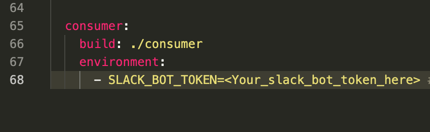
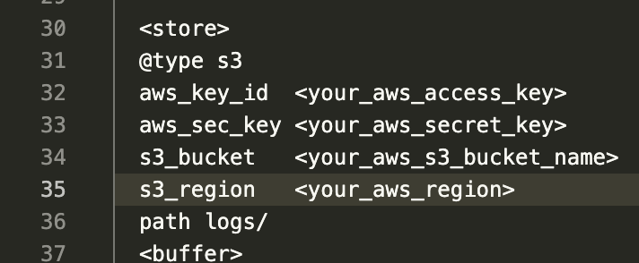
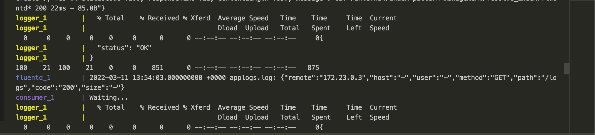
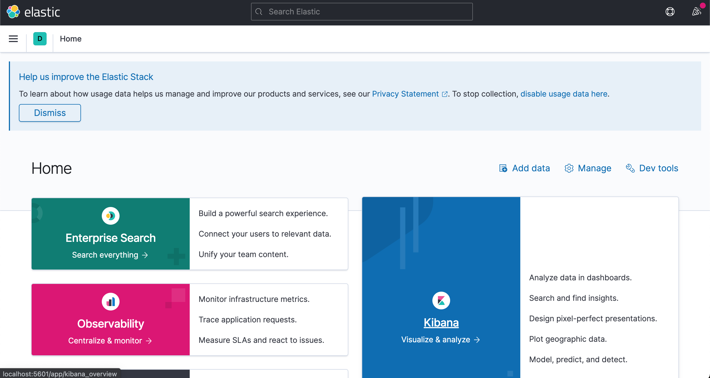
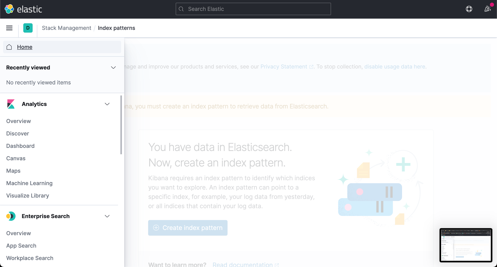
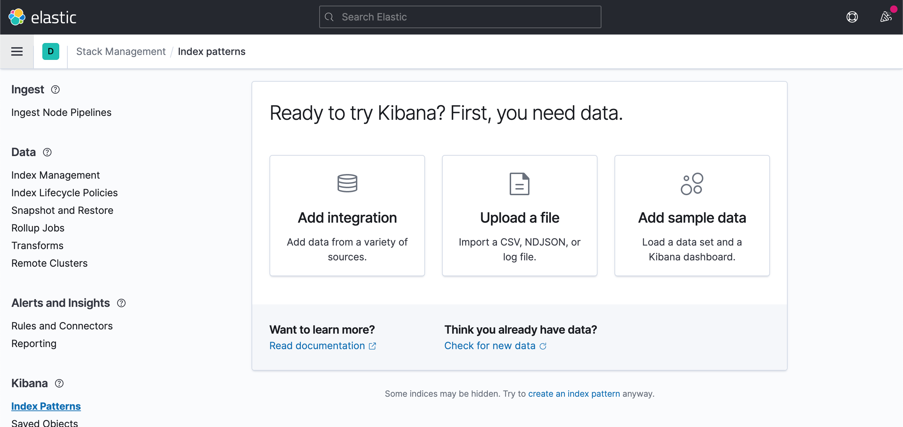
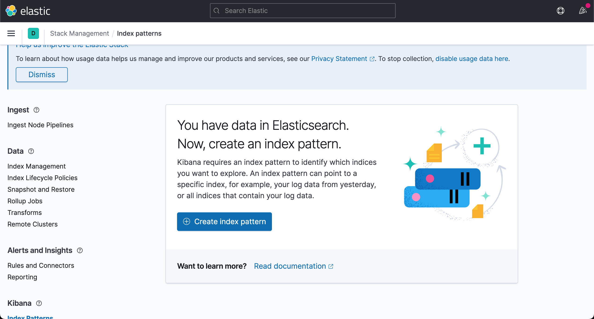
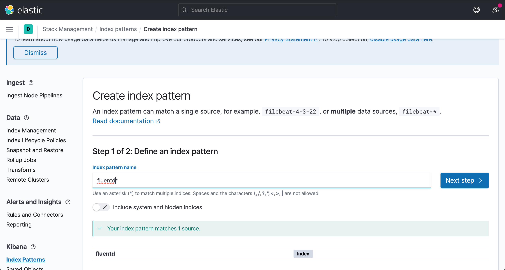
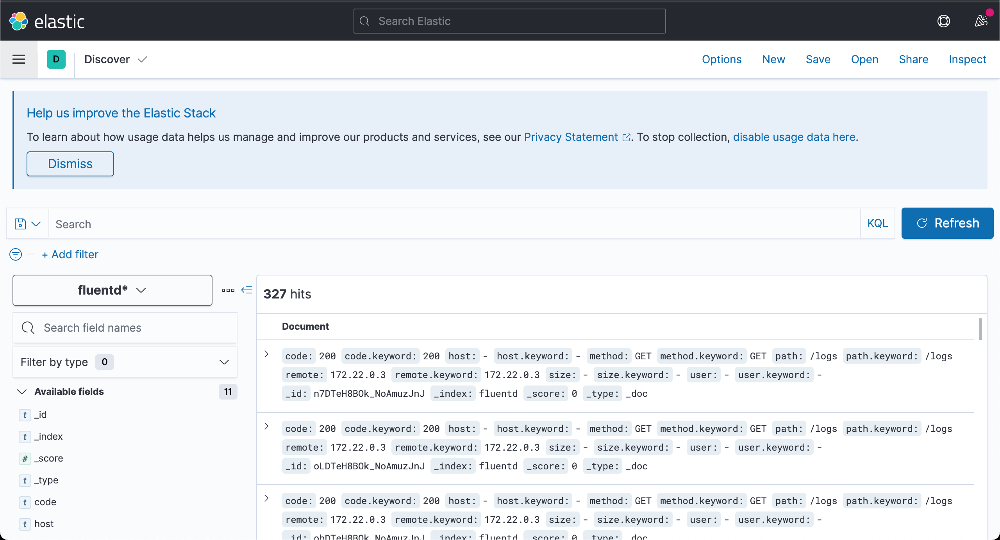
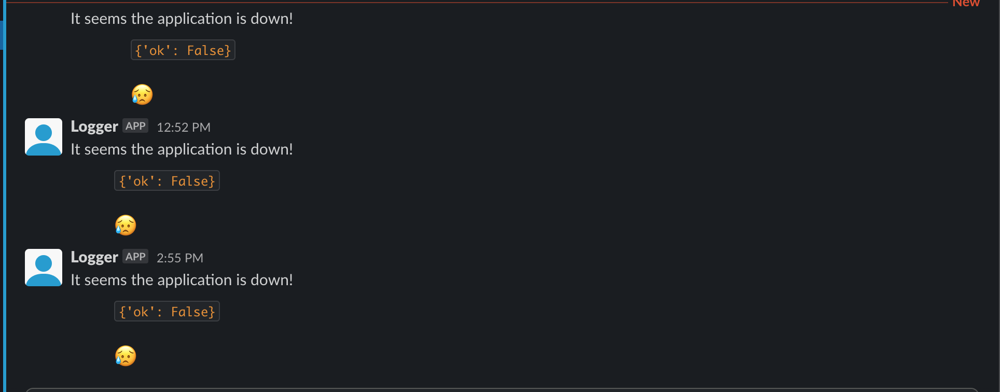

# Centralized logging with Fluentd

This project demonstrates how to implement centralised logging with Fluentd. Fluentd collects logs from the application and pushes them to Elastic search, Kafka and AWS S3

## Prerequisites

To follow along with this demo, here are a few things you need to have installed:

- Docker and Docker Compose: You can install these [here](https://docs.docker.com/get-docker/)

## How to run

- In the docker-compose.yaml file, replace the environment variable for the slack bot token with the token of your own bot

- In the conf/fluent.conf file, enter your aws acces key, secret key, s3 bucket name and aws region to configure fluentd to push logs to the s3 bucket specified

- A `Makefile` has been provided to make setup easy so just run the command `make up` to build and run all the services. Note this might take a few minutes so be patient until all the services have fully initialized and you see logs consistent with what is shown below

- Next, navigate to `http://localhost:5601` in your browser to view the Elastic search UI

- In the side menu, Navigate to the `Discover` section and wait until elastic search picks up the logs from fluentd so you can create an index.

- If no data shows up, keep refreshing and wait a bit for elastic search to pich up the logs

- Create an index pattern called `fluentd*` and then head back to the `Discover` section to view the logs collected by fluentd

- Now, in a new tab, navigate to `http://localhost:5000` to view the demo application. You will notice a big red button that says `BREAK THE APP!`. Click this and it will shutdown the flask server. This is so we can push error logs to Kafka which in turn pushes it to a Slack channel

- Give it a few seconds and you should see your logs appear in the slack channel

- Finally, kill the running process with `CTRL + C` and run the command `make down` to remove all the containers created by docker compose.

## Hire me

Looking for a DevOps engineer / SRE to join your team? Reach out to me by email at [utibeabasiumanah6@gmail.com](mailto://utibeabasiumanah6@gmail.com) or by any of the channels [here](https://linktr.ee/Utibeabasi6)
